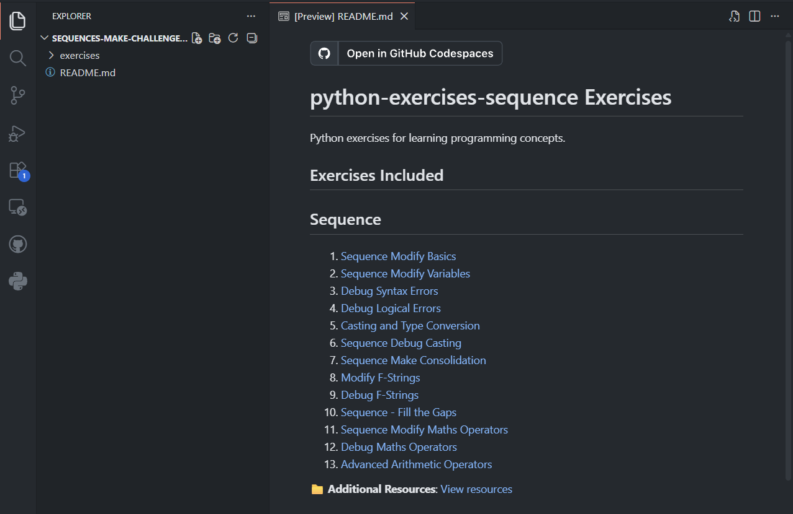
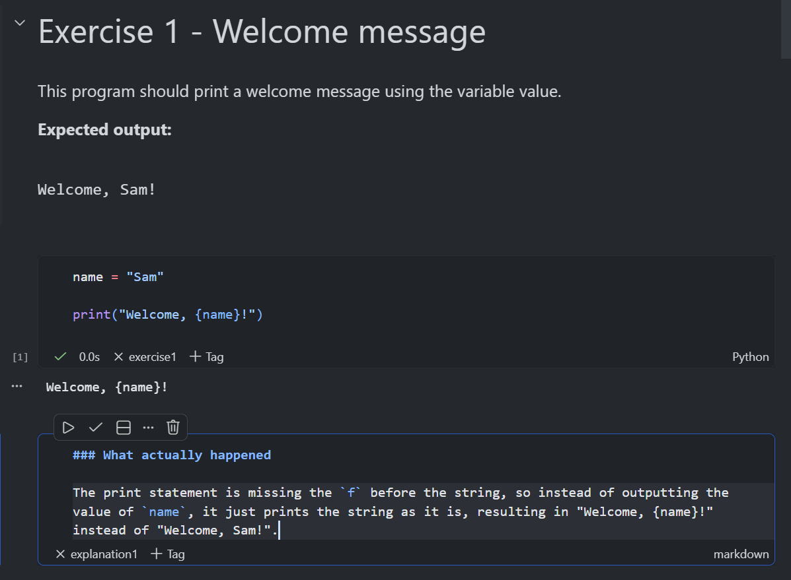
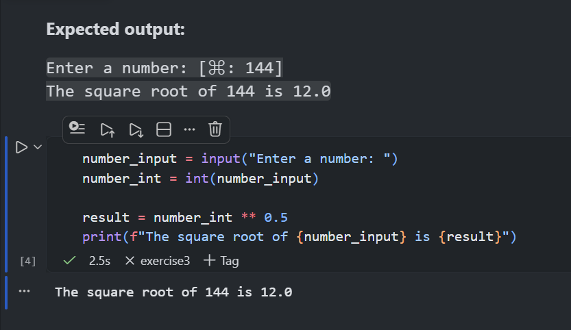

# Python Exercise Generator and Distributor (needs a better name)

A teaching platform for secondary-school programming that keeps everything in the browser: students complete exercises inside Jupyter notebooks, run code inline, and get autograding feedback. Teachers can generate new exercises quickly and bundle selected exercises into GitHub Classroom template repos.

## Key Benefits and Features

- 🖥️ **No local setup or config**: The most your IT technician will need to do is ensure that connections to GitHub and Codespaces are allowed.
- 🌐 **Works on any device with a browser**: Students can work on Chromebooks, tablets, or any device that can run Codespaces. A device with a keyboard and mouse is recommended however.
- 🎯 **Simplified Student Interface**: The student's VSCode environment has been configured to be as minimal and user-friendly as possible, stripping out everything except the notebook editor and the file explorer.

  <figure>
    
    <figcaption>The student VSCode instance has been stripped right back to minimise distractions and opportunities for confusion.</figcaption>
  </figure>
- 💸 **Free and open source**: Github and Codespaces are free, and the free GitHub Education plan gives generous increased limits in Codespaces usage.
- ⚡ **Fast and intelligent feedback loop**: Students get immediate feedback from autograding tests right in their notebooks. Most importantly, the tests check that students are using the correct constructs, not just that they get the right output.
- 📚 **140 exercises and counting**: A growing library of exercises that are ready to use straight away.
- 📊 **Easy tracking**: A custom GitHub Classroom autograder workflow reports results back to the Classroom interface on every push, so you can track student progress and identify common issues.
- 🛠️ **Teaches using industry standard tools**: Students learn how to code in an industry standard development environment, learn version control and have access to a proper debugger.
- 🧠 **Built on sound pedagogical principles**: PRIMM not working for you? Check out my [Modify, Debug, Make](docs/teachers/pedagogy.md) approach.

  <figure>
    
    <figcaption>Example debug activity. Code and instructions are inline — no flicking between tabs and programs.</figcaption>
  </figure>
- 🤖 **Easily generate new exercises**: Use the built-in Exercise Generation assistant (a custom Copilot Chat mode) to scaffold new exercises in seconds, including student notebooks, solutions, and tests.

## How it works

1. You distribute exercises to students using GitHub Classroom. You can use the provided template repository, or create your own with the exercise generation agent.
2. Students open their repository in GitHub Codespaces, which loads a stripped down VSCode environment with the exercise notebooks ready to go.
3. Students work through the exercises, running code inline and using the self-checker cell to get feedback on their progress.

   <figure>
     
     <figcaption>Run code inline by pushing the play button. <strong>Coming soon</strong>: A debugger configuration so students can step through their code inside the notebook.</figcaption>
   </figure>
4. When students commit and push their work, an autograding workflow (currently broken 🚧) runs the tests and reports results back to GitHub Classroom, so you can track progress and identify common issues.

### Feedback and reporting

At the end of each student notebook, there is a self-check cell that runs a simple check and reports the results in a table. The exercise generation agent has detailed instruction on how to create pedagocially appropriate tests that guide students towards the solution without giving too much away. They can expect feedback like this:

<figure>
  
  <figcaption>Tests check for correct output, construct usage, and (in debug activities) student explanations. Students can run the self-checker as often as they need to self-assess.</figcaption>
</figure>

<figure>
  
  <figcaption>Example student activity — a tagged cell with inline feedback.</figcaption>
</figure>

## Status

What works (mostly):

✅ Exercise generation with the Copilot Chat agent.
✅ Template repo creation with notebooks, tests, and VS Code settings
✅ The student self checker cell at the end of each exercise so students can find out how well they've done

Known gaps / not fully working yet:

⚒️ GitHub Classroom autograding (template repo + autograding)
⚒️ Full VS Code for Web support needs a Pyodide‑based Python kernel integration
🚀 There's work to be done on optimising the student devcontainer - currently students still need to select the Jupyter kernel manually after opening the repo in Codespaces.
🖼️Tweaks and formatting changes for the layout of the exercise notebooks as they could be clearer.

Where help is needed:

- Developing student and teacher friendly how-to guides and tutorials. These could be to support the delivery of different programming exercises, guidance on how to set up GitHub Classroom, or how to use the exercise generation assistant.
- VS Code for Web: building a Pyodide‑backed kernel that works with the official Jupyter extension
- Tweaking the student devcontainer config for a smoother and more minimal experience.

## Quickstart

### Exercise Generation

This repo includes a custom Copilot Chat mode for generating exercises.

1. Open this repository in VS Code.
2. Open Copilot Chat and pick the Exercise Generation mode (defined in [.github/agents/exercise_generation.md.agent.md](.github/agents/exercise_generation.md.agent.md)).
3. Describe the exercise (topic, difficulty, examples, and number of parts).
   <figure>
     
     <figcaption>Copilot Chat prompt used to generate a new exercise.</figcaption>
   </figure>
4. Review the generated notebook, tests, and metadata for accuracy, and keep the canonical authoring layout in mind: `exercises/<construct>/<exercise_key>/`, with exercise-specific repository tests under `exercises/<construct>/<exercise_key>/tests/`. Exercise type is metadata, not a path segment.
5. Verify the solution notebook passes tests:
   - [scripts/verify_solutions.sh](scripts/verify_solutions.sh) -q

More detail and expected structure: [docs/exercise-agents/exercise-generation-cli.md](docs/exercise-agents/exercise-generation-cli.md) — Instructions for using the exercise generation CLI tool to scaffold new Python exercises.

### Creating a GitHub Classroom template repo

The template‑repo CLI packages selected exercises into a ready‑to‑use GitHub Classroom template.

1. Install uv and sync the project dependencies:
   - `python -m pip install --upgrade pip uv`
   - `uv sync`
2. Authenticate GitHub CLI:
   - `gh auth login`
3. Create a template repo (example: all sequence exercises):
   - `repoman create --construct sequence --repo-name sequence-exercises`
4. In GitHub Classroom, create a new assignment and select the template repo.

Full CLI reference: [docs/developers/template_repo_cli.md](docs/developers/template_repo_cli.md)
Teacher guide: [docs/teachers/how-to-use-the-template-repo-cli.md](docs/teachers/how-to-use-the-template-repo-cli.md)

## Repository layout (high level)

- [exercises/](exercises/) — canonical authoring tree for exercise-specific assets: `exercises/<construct>/<exercise_key>/`, including exercise-local tests under `exercises/<construct>/<exercise_key>/tests/`
- exported Classroom templates flatten notebooks and exercise tests at packaging time
- [tests/](tests/) — shared pytest discovery, integration tests, and repository-level validation
- [exercise_runtime_support/](exercise_runtime_support/) — shared runtime helpers used by tests and exported templates
- [scripts/](scripts/) — exercise generator + template‑repo CLI
- [docs/](docs/) — documentation

## Documentation

See [docs/README.md](docs/README.md) for a full index organised by audience (teachers, exercise agents, developers).

## License

See [LICENSE](LICENSE) for details.
