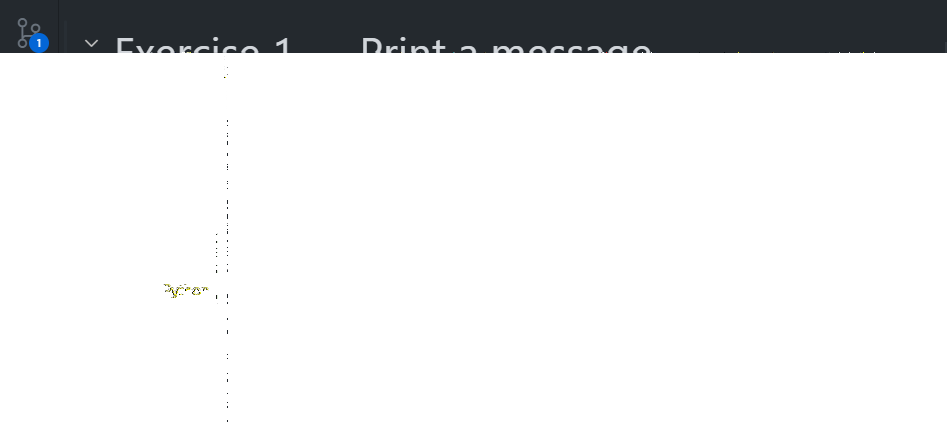
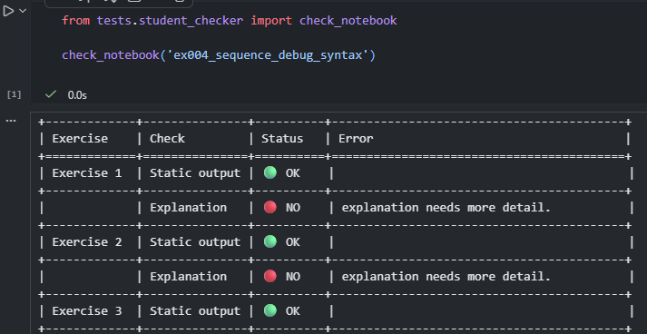
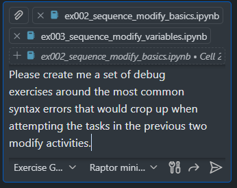

# Python Exercise Generator and Distributor (needs a better name)

A teaching platform for secondary-school programming that keeps everything in the browser: students complete exercises inside Jupyter notebooks, run code inline, and get autograding feedback. Teachers can generate new exercises quickly and bundle selected exercises into GitHub Classroom template repos.

> Source of truth: runtime, discovery, variant, and mapping contracts are defined in [docs/execution-model.md](docs/execution-model.md).

### Migration status

Canonical behaviour is defined in the execution model contract. Flattened notebook/test paths are still transitional export surfaces while migration is completed.

## Key Benefits and Features

 - **No local setup or config**: The most your IT technician will need to do is ensure that connections to GitHub and Codespaces are allowed.
 - **Works on any device with a browser**: Students can work on Chromebooks, tablets, or any device that can run Codespaces. A device with a keyboard and mouse is recommended however.
 - **Free and open source**: Github and Codespaces are free, and the free GitHub Education plan gives generous increased limits in Codespaces usage.
 - **Fast and intelligent feedback loop**: Students get immediate feedback from autograding tests right in their notebooks. Most importantly, the tests check that students are using the correct constructs, not just that they get the right output.
 - **Easy tracking**: A custom GitHub Classroom autograder workflow reports results back to the Classroom interface on every push, so you can track student progress and identify common issues.
 - **Teaches using industry standard tools**: Students learn how to code in an industry standard development environment, learn version control and have access to a proper debugger.
 - **Built on sound pedagogical principles**: PRIMM not working for you? Check out my [Modify, Debug, Make](docs/pedagogy.md) approach.
 - **Easily generate new exercises**: Use the built-in Exercise Generation assistant (a custom Copilot Chat mode) to scaffold new exercises in seconds, including student notebooks, solutions, and tests.

## How it works

<figure style="display:inline-block;">
  
  <figcaption>Figure: Example student activity — a tagged cell with inline feedback.</figcaption>
</figure>

1. You generate exercises using the Exercise Generation assistant (a custom Copilot Chat mode) or use the pre-existing exercises in the repo.
2. You use the [template repo CLI](docs/CLI_README.md) to bundle selected exercises into a GitHub Classroom template repository.
3. You create a Github Classroom assignment using that template and distribute it to students.
4. Students open the assignment in Codespaces, complete the exercises in the browser, and get immediate feedback from the autograding tests.
5. When they commit and push their work, the GitHub Classroom workflow runs the autograding tests again and reports results back to the Classroom interface.
6. ???
7. Profit!

### Feedback and reporting

At the end of each student notebook, there is a self-check cell that runs a simple check and reports the results in a table. The exercise generation agent has detailed instruction on how to create pedagocially appropriate tests that guide students towards the solution without giving too much away. They can expect a table like this:

<figure style="display:inline-block;">
  
  <figcaption>Figure: Example student activity — a tagged cell with inline feedback.</figcaption>
</figure>

## Status

What works (mostly):

- Exercise scaffolding and tests via the generation workflow
- Tagged‑cell autograding ([tests/notebook_grader.py](tests/notebook_grader.py))
- Template repo creation with notebooks, tests, and VS Code settings
- GitHub Classroom workflow (template repo + autograding)

Known gaps / not fully working yet:

- Full VS Code for Web support needs a Pyodide‑based Python kernel integration
- There's work to be done on optimising the student devcontainer - currently students still need to select the Jupyter kernel manually after opening the repo in Codespaces.
- Tweaks and formatting changes for the layout of the exercise notebooks as they could be clearer.

Where help is needed:

- Developing student and teacher friendly how-to guides and tutorials. These could be to support the delivery of different programming exercises, guidance on how to set up GitHub Classroom, or how to use the exercise generation assistant.
- VS Code for Web: building a Pyodide‑backed kernel that works with the official Jupyter extension
- Tweaking the student devcontainer config for a smoother and more minimal experience.

## Quickstart

### Exercise Generation

This repo includes a custom Copilot Chat mode for generating exercises.

1. Open this repository in VS Code.
2. Open Copilot Chat and pick the Exercise Generation mode (defined in [.github/agents/exercise_generation.md.agent.md](.github/agents/exercise_generation.md.agent.md)).
3. Describe the exercise (topic, difficulty, examples, and number of parts).
   <figure style="display:inline-block;">
     
     <figcaption>Figure: Copilot Chat prompt used to generate a new exercise.</figcaption>
   </figure>
4. Review the generated notebook, tests, and metadata for accuracy, and keep the canonical authoring location in mind: `exercises/<construct>/<exercise_key>/`. Exercise type is metadata, not a path segment.
5. Verify the solution notebook passes tests:
   - [scripts/verify_solutions.sh](scripts/verify_solutions.sh) -q

More detail and expected structure: [docs/exercise-generation-cli.md](docs/exercise-generation-cli.md) — Instructions for using the exercise generation CLI tool to scaffold new Python exercises.

### Creating a GitHub Classroom template repo

The template‑repo CLI packages selected exercises into a ready‑to‑use GitHub Classroom template.

1. Install uv and sync the project dependencies:
   - `python -m pip install --upgrade pip uv`
   - `uv sync`
2. Authenticate GitHub CLI:
   - `gh auth login`
3. Create a template repo (example: all sequence exercises):
   - `template_repo_cli create --construct sequence --repo-name sequence-exercises`
4. In GitHub Classroom, create a new assignment and select the template repo.

> Note: use the explicit variant contract to run instructor-solution checks:
>
> ```bash
> uv run python scripts/run_pytest_variant.py --variant solution -q
> ```

Full CLI reference: [docs/CLI_README.md](docs/CLI_README.md)

## Repository layout (high level)

- [exercises/](exercises/) — canonical authoring tree for exercise-specific assets: `exercises/<construct>/<exercise_key>/`
- [notebooks/](notebooks/) — transitional and exported flattened student notebooks
- [notebooks/solutions/](notebooks/solutions/) — transitional flattened instructor solutions
- [tests/](tests/) — shared pytest discovery plus transitional/exported flattened exercise tests
- [exercise_runtime_support/](exercise_runtime_support/) — shared runtime helpers used by tests and exported templates
- [scripts/](scripts/) — exercise generator + template‑repo CLI
- [docs/](docs/) — documentation

## Documentation

- [docs/project-structure.md](docs/project-structure.md)
- [docs/testing-framework.md](docs/testing-framework.md)
- [docs/exercise-generation.md](docs/exercise-generation.md) — Guide to using the Exercise Generation assistant (Copilot) to create exercises quickly.
- [docs/exercise-generation-cli.md](docs/exercise-generation-cli.md) — Instructions for using the exercise generation CLI tool to scaffold new Python exercises.
- [docs/setup.md](docs/setup.md)
- [docs/CLI_README.md](docs/CLI_README.md)

## License

See [LICENSE](LICENSE) for details.
