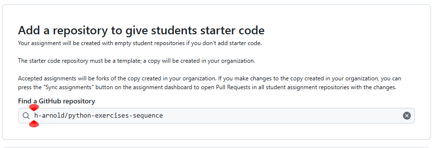
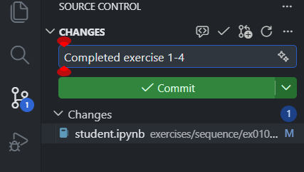

# Python Exercise Generator and Distributor (needs a better name)

A teaching platform for secondary-school programming that keeps everything in the browser: students complete exercises inside Jupyter notebooks, run code inline, and get autograding feedback. Teachers can generate new exercises quickly and bundle selected exercises into GitHub Classroom template repos.

## Key Benefits and Features

- 🖥️ **No local setup or config**: The most your IT technician will need to do is ensure that connections to GitHub and Codespaces are allowed.
- 🌐 **Works on any device with a browser**: Students can work on Chromebooks, tablets, or any device that can run Codespaces. A device with a keyboard and mouse is recommended however.
- 🎯 **Simplified Student Interface**: The student's VSCode environment has been configured to be as minimal and user-friendly as possible, stripping out everything except the notebook editor and the file explorer.
- 💸 **Free and open source**: Uses entirely free and open technologies owned by you. No disappearing act when a provider decides the education market isn't worth serving ([looking at you, replit](https://www.datawars.io/articles/replit-teams-for-education-deprecation-all-you-need-to-know))
- ⚡ **Fast and intelligent feedback loop**: Students get immediate feedback from autograding tests right in their notebooks. Most importantly, the tests check that students are using the correct constructs, not just that they get the right output.
- 📚 **140 exercises and counting**: A growing library of exercises that are ready to use straight away.
- 📊 **Easy tracking**: A custom GitHub Classroom autograder workflow reports results back to the Classroom interface on every push, so you can track student progress and identify common issues.
- 🛠️ **Teaches using industry standard tools**: Students learn how to code in an industry standard development environment, learn version control and have access to a proper debugger.
- 🧠 **Built on sound pedagogical principles**: PRIMM not working for you? Check out my [Modify, Debug, Make](docs/teachers/pedagogy.md) approach.
- 🤖 **Easily generate new exercises**: Use the built-in Exercise Generation assistant (a custom Copilot Chat mode) to scaffold new exercises in seconds, including student notebooks, solutions, and tests.

## How it works

1. You distribute exercises to students using GitHub Classroom. You can use the provided template repository, or create your own with the exercise generation agent.

  <figure>
    
    <figcaption>Choosing the template repository to use in Github Classroom</figcaption>
  </figure>

2. Students click the invite generated in step 1, which opens their repository in GitHub Codespaces with a stripped down VSCode interface and the exercises ready to use.

  <figure>
    
    <figcaption>The student VSCode instance has been stripped right back to minimise distractions and opportunities for confusion.</figcaption>
  </figure>

3. Students work through the exercises, running code inline to check their output and (⚒️ coming soon) using the built-in VS Code debugger to step through code and inspect variables.

   <figure>
     
   </figure>

4. Students run the self-checker cell at the end of each notebook to get feedback on how they're doing. Tests are generated to check that students have got the correct output, used the correct constructs and in debug activities, explained their thinking.

<figure>
  
</figure>

5. When students commit and push their work, an autograding workflow (currently broken 🚧) runs the tests and reports results back to GitHub Classroom, so you can track progress and identify common issues. This also gives them an opportunity to develop good habits and understanding of version control.

<figure>
  
</figure>

[Read the full getting started guide for teachers here](docs/teachers/getting-started.md)

## Status

What works (mostly):

✅ Exercise generation with the Copilot Chat agent.
✅ Template repo creation with notebooks, tests, and VS Code settings
✅ The student self checker cell at the end of each exercise so students can find out how well they've done

Known gaps / not fully working yet:

⚒️ GitHub Classroom autograding (template repo + autograding)
⚒️ Full VS Code for Web support needs a Pyodide‑based Python kernel integration
🚀 There's work to be done on optimising the student devcontainer - currently students still need to select the Jupyter kernel manually after opening the repo in Codespaces.
🖼️Tweaks and formatting changes for the layout of the exercise notebooks as they could be clearer.

Where help is needed:

- Developing student and teacher friendly how-to guides and tutorials. These could be to support the delivery of different programming exercises, guidance on how to set up GitHub Classroom, or how to use the exercise generation assistant.
- VS Code for Web: building a Pyodide‑backed kernel that works with the official Jupyter extension
- Tweaking the student devcontainer config for a smoother and more minimal experience.

## Documentation

See [docs/README.md](docs/README.md) for the complete documentation.

## Repository layout (high level)

- [exercises/](exercises/) — canonical authoring tree for exercise-specific assets: `exercises/<construct>/<exercise_key>/`, including exercise-local tests under `exercises/<construct>/<exercise_key>/tests/`
- exported Classroom templates flatten notebooks and exercise tests at packaging time
- [tests/](tests/) — shared pytest discovery, integration tests, and repository-level validation
- [exercise_runtime_support/](exercise_runtime_support/) — shared runtime helpers used by tests and exported templates
- [scripts/](scripts/) — exercise generator + template‑repo CLI
- [docs/](docs/) — documentation

## License

See [LICENSE](LICENSE) for details.
