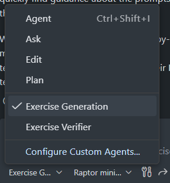

# Generating Exercises with GitHub Copilot

This guide explains how to use the **Exercise Generation** assistant in GitHub Copilot to create new Python exercises for students. This tool is designed to help you quickly create pedagogically sound exercises without needing to manually write all the boilerplate code.

- [Generating Exercises with GitHub Copilot](#generating-exercises-with-github-copilot)
  - [First Time Setup](#first-time-setup)
    - [What to expect after cloning (prompts \& tips)](#what-to-expect-after-cloning-prompts--tips)
  - [Using the Exercise Generation Assistant](#using-the-exercise-generation-assistant)
    - [1. Select the Agent](#1-select-the-agent)
    - [2. Crafting Your Prompt](#2-crafting-your-prompt)
      - [Example Scenario A: Reinforcing Recent Lessons](#example-scenario-a-reinforcing-recent-lessons)
      - [Example Scenario B: Targeting Misconceptions](#example-scenario-b-targeting-misconceptions)
    - [3. Iterating on Content](#3-iterating-on-content)
    - [4. Saving Your Work](#4-saving-your-work)
  - [Exercise Verifier — quick quality checks 🔍](#exercise-verifier--quick-quality-checks-)
    - [Recommended models — cost vs. quality 💡](#recommended-models--cost-vs-quality-)
  - [Best Practices](#best-practices)


## First Time Setup

If you are new to Visual Studio Code (VS Code) or GitHub Copilot, follow these steps to get ready:

1. **Create a GitHub account**: You will need a GitHub account so you can clone the repository and sign in to Copilot. If you don't have an account, sign up at https://github.com. Note: your organisation may require a Copilot subscription.

2. **Clone the repository**: In VS Code use **Source Control** → **Clone Repository**, or open the Command Palette (`Ctrl+Shift+P` / `Cmd+Shift+P`) and run **Git: Clone**. Paste this URL: `https://github.com/h-arnold/PythonTutorExercises.git`. (If you already have a local copy, you can instead use **File > Open Folder...** and select the `PythonTutorExercises` folder.) After opening the workspace, see the [What to expect after cloning (prompts & tips)](#what-to-expect-after-cloning-prompts--tips) section below for guidance on common VS Code prompts and recommended actions.

3. **Sign in to GitHub in VS Code**: Click the Accounts icon in the bottom-left of VS Code and sign in with your GitHub account so extensions (Copilot) can access it.

4. **Check Extensions**:
   - Click the **Extensions** icon in the left sidebar (it looks like four squares with one detached).
   - Search for "GitHub Copilot" and install **GitHub Copilot** and **GitHub Copilot Chat** if they are not already installed.

5. **Open Chat**: Click the **Chat** icon in the sidebar (a speech bubble) or press `Ctrl + Alt + I` (Windows) / `Cmd + Ctrl + I` (Mac) to open Copilot Chat.

6. **Select Exercise Generation chatmode**: In the Chat panel, open the model/agent selector (top of the chat window) and choose **Exercise Generation** so the assistant uses the repository-specific exercise templates and guidelines. If you don't see it, sign out and sign back in to Copilot or reload the window (`Ctrl+Shift+P` / `Cmd+Shift+P` → "Developer: Reload Window").



*Figure: Copilot Chat — the model/agent selector appears at the top of the chat panel (used to select **Exercise Generation**); the conversation area shows example prompts you can copy and edit.*

### What to expect after cloning (prompts & tips)

When you open the cloned repository in VS Code you may see a few helpful prompts — these are normal and aimed at making the workspace easier to work with. Here's what you might see and what to do:

- **Recommended extensions pop-up**: The workspace recommends extensions including `ms-python.python`, `ms-python.vscode-pylance`, `charliermarsh.ruff`, `github.copilot`, and `github.copilot-chat`. Installing these is recommended (particularly Copilot and Pylance) but you can decline if your school has restrictions.

- **Python interpreter / virtual environment prompt**: VS Code will try to use the interpreter at `${workspaceFolder}/.venv/bin/python` (configured in the workspace settings). If `.venv` doesn't exist yet, you'll be prompted to select an interpreter or create a virtual environment. Recommended quick setup:

  ```bash
  python -m pip install --upgrade pip uv
  uv sync
  ```

- **Test discovery prompt**: Because the workspace enables pytest in the workspace settings, VS Code may ask to enable test discovery; allow this if you want to run tests from the Test sidebar.

- **Format-on-save / code actions**: The workspace config enables `editor.formatOnSave` and code-actions-on-save for Python. If you prefer not to change files automatically, you can disable format-on-save in the Command Palette or your personal settings.

- **Debug configurations**: `launch.json` includes useful debug entries (run a single file or run pytest). These won't prompt you, but they appear in the Run & Debug view.

If any prompt looks unfamiliar, you can safely decline and follow the manual setup steps above — or consult your IT admin if your school restricts extension installation.

## Using the Exercise Generation Assistant

This repository includes a specialized helper called the **Exercise Generation** agent. It knows how our grading system works and how to structure exercises for our students.

### 1. Select the Agent
In the Chat panel you just opened:
- Look for the model/agent selector (usually at the top or bottom of the chat window).
- Select **Exercise Generation** (you might see it in a dropdown list or by typing `@Exercise Generation`).
- *Note: If you don't see it, ensure you have the repository folder open as your workspace root.*

### 2. Crafting Your Prompt
The most important step is asking the right question. The agent works best when you give it **teaching context**. 

Instead of asking "Write a loop exercise", explains what the students need to practice.

#### Example Scenario A: Reinforcing Recent Lessons
*You want to solidify knowledge after a specific exercise.*

> **Prompt to copy:**  
> "Please create a set of logical error debug tasks that build on the most common logical errors you might find when writing code similar to those in ex003"

**Why this works:** 
- It references `ex003`, so the agent knows the difficulty level.
- It asks for "logical error debug tasks" (code that runs but gives the wrong answer), which forces students to read code carefully.

#### Example Scenario B: Targeting Misconceptions
*You want to address common mistakes you see in class.*

> **Prompt to copy:**  
> "Please create me a set of debug exercises around the most common syntax errors that would crop up when attempting the tasks in the previous two modify activities."

**Why this works:**
- It asks for "syntax errors" (code that breaks/crashes).
- It contextualizes it to the "previous two modify activities", creating a realistic follow-up to their recent work.

### 3. Iterating on Content
The agent will generate a response, often including a plan or code snippets. 
- **Too hard?** Reply: "Simplify the second task for a beginner."
- **Wrong focus?** Reply: "Less focus on math, more on string manipulation."
- **Need files?** Reply: "What command should I run to create these files?"

### 4. Saving Your Work
Once the agent gives you the exercise content (the "solution" code and the "student" instructions):

1. **Create the file structure**:
   Open the **Terminal** (`Ctrl + \`` or **Terminal > New Terminal**) and run the command the agent suggests:
   ```bash
   python scripts/new_exercise.py ex050 "My New Topic" --slug my_topic
   ```
2. **Add the Content**:
   - Open `notebooks/solutions/ex050_my_topic.ipynb`.
   - Paste the code provided by the agent into the appropriate cells.
3. **Verify**:
   Run the tests to make sure everything works:
   ```bash
   pytest tests/test_ex050_my_topic.py
   ```

## Exercise Verifier — quick quality checks 🔍

The **Exercise Verifier** is a companion verification agent that reviews newly-created or updated exercises against repository standards (structure, tags, sequencing, tests, teacher guidance, and order-of-teaching). It is typically invoked automatically as a sub-agent by the **Exercise Generation** agent, but you can also call it manually if you want an immediate verification.

How to run it manually:
- **From Copilot Chat**: Select the **Exercise Verifier** chatmode and ask something like:
  - "Verify exercise ex050_my_topic" or
  - "Please verify notebooks/ex050_my_topic.ipynb — construct: sequence, type: modify"
- **Locally (command line)**:
  ```bash
  python scripts/verify_exercise_quality.py notebooks/ex050_my_topic.ipynb --construct sequence --type modify
  ```

What it checks:
- Gate A–F (see repo guidelines): exercise-type compliance, construct sequencing, tags & notebook structure, tests, teacher docs, and inclusion in `OrderOfTeaching.md`.
- It follows the rules in `docs/exercise-types/` and the verifier agent spec (`.github/agents/exercise_verifier.md.agent.md`).

Output:
- The verifier returns a concise verdict: **PASS**, **PASS WITH NITS**, or **FAIL**, plus specific, minimal fixes (file(s) and suggestions).

**Tip:** Provide the exercise id/slug (e.g., `ex050_my_topic`) or the notebook path when asking — the verifier needs one of these to run targeted checks.

### Recommended models — cost vs. quality 💡

- **Raptor-mini (Preview)** — Tested and recommended for classroom use. The agent workflows in this repository have been validated with Raptor-mini. It is available with **50 free messages/month** on the free plan and **unlimited messages** for users with GitHub Education. Raptor-mini produces perfectly workable results when used with the standard verification step (always run the Exercise Verifier after generation).

- **Sonnet 4.5 / Codex 5.2** — More powerful models that tend to produce higher-quality and faster outputs, especially for complex or subtle tasks. They are, however, more costly; use them for large batches, complex exercises, or when you need higher confidence in a single pass.

Practical tips:
- For most classroom work, start with **Raptor-mini** and **always** run the Exercise Verifier afterwards.
- If you repeatedly need the generator to hit edge cases in one run, consider using **Sonnet 4.5** or **Codex 5.2** for that run, then run the verifier as usual.
- You can select the model in Copilot Chat using the model/agent selector; choose the preferred model or let the agent default to the recommended model for the workspace.

## Best Practices
- **Small Batches:** Generate 1 exercises at a time rather than a whole chapter.
- **Fresh Context**: Start a new chat for each exercise for best results. 
- **Be Specific about Type:** 
  - **Debug**: Students fix broken code.
  - **Modify**: Students change working code.
  - **Make**: Students write from scratch.
  The agent knows the specific templates for these types.
