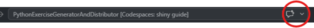
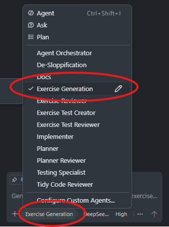

# Generating Exercises with GitHub Copilot

This guide explains how to use the **Exercise Generation** assistant in GitHub Copilot to create new Python exercises for your students — without needing to write all the boilerplate code yourself.

The agent handles the technical details: it creates the right files in the right places, writes the student notebook, prepares a solution notebook for you, and structures everything so students can self-assess against automated tests. You focus on the teaching.

---

## Getting Started

### 1. Open the repository in VS Code

**If this is your first time:**

1. Open Visual Studio Code.
2. Open the Command Palette by pressing `Ctrl+Shift+P` (Windows) or `Cmd+Shift+P` (Mac).
3. Type **Git: Clone** and select it.
4. Paste the repository URL for `PythonExerciseGeneratorAndDistributor` and choose where to save it.
5. Once cloned, use **File > Open Folder...** to open the folder you just downloaded.

**If you have already cloned the repository before:**

Open the folder in VS Code (**File > Open Folder...**), then open a terminal (**Terminal > New Terminal**) and run:

```bash
git pull
```

This ensures you have the latest version of the exercise tools and templates.

### 2. Sign in to GitHub

Click the Accounts icon in the bottom-left corner of VS Code and sign in with your GitHub account. This lets Copilot know who you are.

### 3. Open Copilot Chat

In the top toolbar, click the **Chat** button — it looks like a speech bubble icon next to the command palette.



### 4. Select the Exercise Generation agent

At the top of the Chat panel there is a dropdown menu showing the current model or agent. Open it and select **Exercise Generation**.



> If you don't see **Exercise Generation** in the list, make sure you have the repository folder open as your workspace root, then try signing out and back in to Copilot, or reload the window (`Ctrl+Shift+P` → "Developer: Reload Window").

---

## Writing Your First Prompt

The agent works best when you describe what your students need to practise. Think of it like telling a colleague what you want — the more context you give, the better the result.

Instead of: *"Write a loop exercise"*

Try: *"Create a set of exercises for my Year 9 class practising for loops. They have just finished learning about range() and need more practice counting through sequences."*

### Example prompts you can copy

**Reinforcing a recent lesson:**

> "Please create a set of logical error debug tasks that build on the most common logical errors you might find when writing code similar to those in ex003"

This works because it references a previous exercise (so the agent knows the difficulty level) and asks for logical errors (code that runs but gives the wrong answer), which forces students to read code carefully.

**Targeting a common misconception:**

> "Please create me a set of debug exercises around the most common syntax errors that would crop up when attempting the tasks in the previous two modify activities."

This works because it asks for syntax errors (code that crashes) and links to work students have already done.

### Saying what type of exercise you want

The agent tailors the notebook format depending on the exercise type. You can mix types across different notebooks, but keep one notebook to one type:

| Type | What students do |
|------|-----------------|
| [**Debug**](../exercise-agents/exercise-types/debug.md) | Fix broken code that either crashes or gives the wrong answer |
| [**Modify**](../exercise-agents/exercise-types/modify.md) | Change working code to meet new requirements |
| [**Gap-fill**](../exercise-agents/exercise-types/gaps.md) | Write missing lines inside a partially written program |
| [**Make**](../exercise-agents/exercise-types/make.md) | Write a solution from scratch |

---

## What Happens Next

Once you send your prompt, the agent will:

1. **Create the files** — It sets up a student notebook and a matching solution notebook in the correct folder.
2. **Write the exercises** — It fills in the notebooks one exercise at a time, gradually increasing the difficulty. For a 10-exercise notebook, it will create exercises 1 through 10, each harder than the last.
3. **Check its own work** — It runs automated quality checks on the notebooks to catch problems like incorrect tags or concepts that are too advanced.

The agent will show you what it has created and ask for your feedback before moving on.

---

## Reviewing and Refining

Your main job is to review what the agent produces and ask for changes.

**Open both notebooks** (you can find them under the `exercises/` folder in the file explorer). Look for:

- Is the difficulty right for your class? If not, just say: *"Simplify the second task"* or *"Make exercise 5 harder"*.
- Are the instructions clear without giving away the answer? If a prompt is too obvious, say: *"Do not hint at the answer in exercise 3"*.
- Does the solution notebook show correct, step-by-step solutions? If it uses shortcuts, say: *"Show each step on a separate line in the solution"*.

Keep going back and forth until you are happy. The agent is designed to be iterative — you do not need to get it perfect on the first try.

> 💡**Tip**: Be as specific and precise as possible. The better your instructions are, the better the outcome will be.

---

## What Happens After You Approve

Once you have reviewed both notebooks and are happy with them, tell the agent something like: *"Looks good, please proceed."*

The agent then:

- Generates supporting materials (a short README for the exercise and teacher notes).
- Runs a final quality check to make sure everything is complete.
- Hands off to the **Exercise Test Creator**, which writes automated tests for the exercises.

**You do not need to write or run any tests.** Those are generated automatically and checked for you. The tests are what let your students check their own work — they run the notebook, write their code, and the tests tell them whether they got it right.

---

## Modifying an Existing Exercise

You can also use the Exercise Generation agent to update or extend exercises you have already created. The process works the same way as creating new ones — the agent makes the changes, you review them, and the tests are updated to match.

**Example prompt:**

> "I need to update ex012 to change the focus from for loops to while loops. Keep the same topic (running totals), just change the construct. Also update the tests to match the new approach."

Or for smaller tweaks:

> "The third task in ex008 is too difficult for my class. Can you simplify it so it only asks them to fill in one missing line instead of three?"

**What happens:**

1. The agent reads the existing exercise files.
2. It makes the changes you asked for in the student notebook and solution notebook.
3. It runs the quality checks to make sure everything still holds together.
4. It updates the tests to match the new or changed exercises.

**Your job is the same:** review the updated notebooks and tests, ask for refinements if needed, and then approve.

---

## Saving Your Changes

Once you are happy with your exercises, you need to save them back to GitHub so they are backed up and ready to use.

### Commit and push

1. In VS Code, click the **Source Control** icon in the left sidebar (it looks like a branching tree).
2. You will see a list of changed files. Review them to make sure everything looks right.
3. At the top of the Source Control panel, type a short message describing what you changed — for example, *"Added ex050 (modify: string concatenation)"* or *"Simplified exercise 3 in ex008"*.
4. Click the **Commit** button (✓) to save a snapshot of your changes locally.
5. Click **Sync Changes** or **Push** to upload your changes to GitHub.

### Creating a pull request (for bigger changes)

For larger edits — especially if you are unsure about them — it is safer to use a pull request. This keeps the original work intact until you are certain the changes are ready.

1. In the bottom-left corner of VS Code, click the branch name (it will say **main** by default).
2. Select **Create new branch...** and give it a name, such as *add-ex050* or *simplify-ex008*.
3. Make your changes and commit them as normal (the commit goes to your new branch).
4. Open the **Source Control** panel, click the **...** menu, and select **Push**.
5. VS Code will show a prompt offering to create a pull request on GitHub — follow the prompts. This opens a page in your browser where you can review and submit the request.

Once the pull request is merged, your changes are saved to the main branch. You can then go back to VS Code, switch back to the **main** branch, and use **git pull** to get the latest version.

---

## Tips

- **Be specific about what you want** — A good prompt explains what students already know, what they find difficult, and what you want them to practise.
- **Work through one notebook at a time** — Finish reviewing one set of exercises before starting the next.
- **Start a fresh chat for each new exercise** — The agent works best with a clean context.
- **Say exactly what needs to change** — Instead of "fix this", say "add a worked example before exercise 3" or "make exercise 7 focus on string concatenation instead".
- **Do not worry about the file structure** — The agent handles all of that. If you are curious about how things are organised under the hood, see the [developer documentation](../developers/project-structure.md).

---

*Need help? Ask the Exercise Generation agent directly, or check the [developer docs](../developers/) for detailed technical information.*

---

## Next Steps — Sharing Exercises with Students

Once your exercises are saved on GitHub, the next step is to turn them into a **template repository** that you can use in GitHub Classroom. This is how students get their own copies to work on.

See the guide: [Creating Template Repositories for GitHub Classroom](how-to-use-the-template-repo-cli.md)
