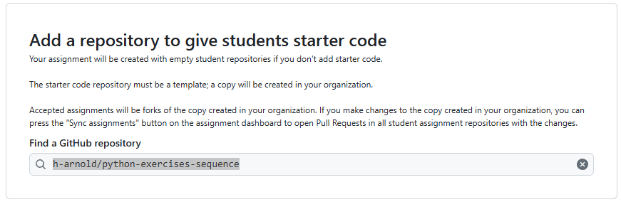
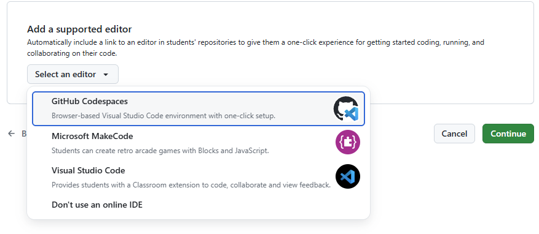
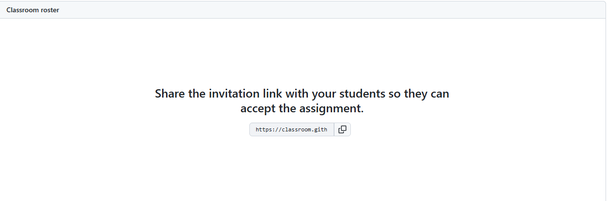
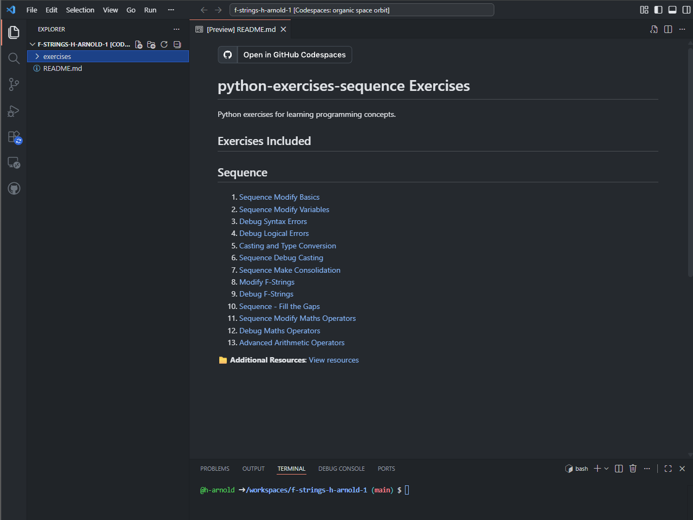
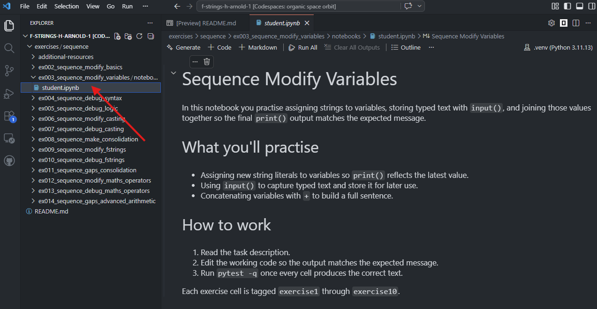
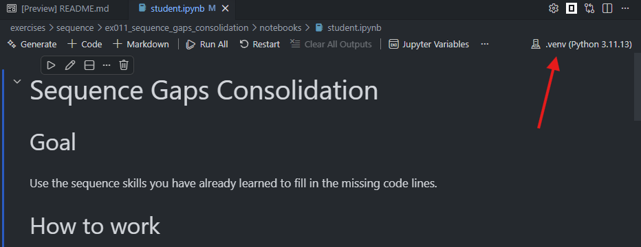
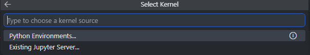
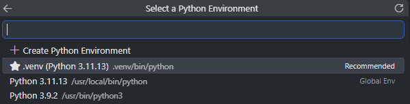

# Getting Started — Your First Exercise Set

This guide shows you the fastest way to get Python exercises into your students' hands using pre-built template repositories. You only need a browser and a GitHub account — no installation, no command line, no exercise creation.

- [Getting Started — Your First Exercise Set](#getting-started--your-first-exercise-set)
  - [The big picture](#the-big-picture)
  - [Prerequisites](#prerequisites)
  - [Step 1: Understand the tools](#step-1-understand-the-tools)
  - [Step 2: Pick a template repository](#step-2-pick-a-template-repository)
  - [Step 3: Create a GitHub Classroom assignment](#step-3-create-a-github-classroom-assignment)
    - [3.1 Create a new GitHub Classroom](#31-create-a-new-github-classroom)
    - [3.2 Create a new assignment](#32-create-a-new-assignment)
    - [3.3 Link your template repository](#33-link-your-template-repository)
    - [3.4 Creating your assignment](#34-creating-your-assignment)
    - [3.5 Share the invite link](#35-share-the-invite-link)
  - [3.6 What the students need to do](#36-what-the-students-need-to-do)
  - [Step 4: Students complete the exercises](#step-4-students-complete-the-exercises)
    - [4.1 Choose an exercise](#41-choose-an-exercise)
    - [4.2 Selecting the python kernel](#42-selecting-the-python-kernel)
    - [4.2 Completing the exercises](#42-completing-the-exercises)
      - [How to tell if it has been selected or not](#how-to-tell-if-it-has-been-selected-or-not)
      - [How to select the correct kernel](#how-to-select-the-correct-kernel)
    - [4.3 Check progress with the self-checker](#43-check-progress-with-the-self-checker)
    - [4.4 Save and submit work](#44-save-and-submit-work)
    - [4.5 What you'll see as a teacher](#45-what-youll-see-as-a-teacher)
  - [What next?](#what-next)

---

## The big picture

Here's what you'll end up with by the end of this tutorial:

```text
Existing template repo ──► Classroom assignment ──► Student copies
(already built and       (you create this,        (each student
 ready to use)            students accept)         gets their own)
```

## Prerequisites

- Access to Github and Github Codespaces. Some schools block these by so check with your IT team if you have trouble accessing them. More information here: [IT Network Requirements](it-network-requirements.md)
- A GitHub account. If you don't have one, sign up at [github.com](github.com).

> Tip: Sign up to [GitHub Education](https://github.com/education) to get extra Codespaces hours (50 on free, 150 on GitHub Education), amongst other benefits.

---

## Step 1: Understand the tools

Before you start, read the overview of the key concepts:

> **[Understanding the Tools](understanding-the-tools.md)** — a plain-English guide to GitHub, GitHub Classroom, Codespaces, version control, and Jupyter notebooks.

It takes about 10 minutes and explains how all the pieces fit together. You can come back to it later as a reference.

**When you're done, return here and move to Step 2.**

---

## Step 2: Pick a template repository

The **[Construct Template Repositories](construct-template-repos.md)** page lists every pre-built template repository available in this project. Each one bundles all the exercises for a topic — for example, `sequence` or `selection` — and is ready to use in GitHub Classroom.

Browse the table, then choose the template repo that matches what you want to teach this week. Here's a quick example:

> **🛠️ Can't find the combination you need?** See [Creating Custom Exercise Sets](creating-exercise-sets.md) for how to build your own template repos or create new exercises.

---

## Step 3: Create a GitHub Classroom assignment

> **ℹ️ Note:** GitHub Classroom is being sunsetted by GitHub. This workflow will work for at least the next year and will be updated with its FOSS replacement when it's ready.

Now you'll turn your chosen template repository into a classroom assignment.

### 3.1 Create a new GitHub Classroom

1. Open [classroom.github.com](https://classroom.github.com) in your browser.
2. Sign in with your GitHub account.
3. If you haven't used Classroom before, you'll be asked to authorise it — click **Authorise GitHub Classroom**.
4. Click **New classroom** and follow the instructions to create one.

### 3.2 Create a new assignment

1. Inside your classroom, click the **Assignments** tab, then **New assignment**.
2. Give it a title — for example, "Week 1: Getting Started with Python".
3. (Optional) Set a deadline. Students can still submit after the deadline, but late work is marked clearly.
4. Choose **Individual assignment** or **Group assignment** — most programming exercises use individual.
5. Click **Continue**.

### 3.3 Link your template repository

1. Under **Find a Github repository**, enter one of the template repository names you picked in Step 2 (for example, `h-arnold/python-exercises-sequence`) and select it.



2. **Optional but recommended**: set **Repository visibility** to **Private**. This keeps students from seeing each other's work. and leave **Give students admin access to their repository** unchecked. This prevents students from accidentally deleting their work.
3. On **Add a supported editor**, select **Codespaces**. 


4. Click **Continue** to move to the next step.

### 3.4 Creating your assignment

This will take you to the **Set up autograding and feedback** page. You can skip this step - it gets set up autmatically for you anyway. 

1. Scroll to the bottom of the page and click **Create assignment**.

### 3.5 Share the invite link

This will take you to the Github Classroom Assignment page that you just created.

1. Copy the invite link:
  


2. Share this link with your students in the normal way (e.g. on MS Teams or Google Classroom).

## 3.6 What the students need to do

1. They need to click on the link you gave them. This will invite them to the assignment and if they haven't joined the classroom already, accepting this assignment will add them to the GitHub Classroom.
2. They need to click 'Accept this assignment'.
3. They need click the **Open in Codespaces** button to start their Codespace. 

> Tip: Opening codespaces will take a few minutes to get started the first time, so tell students to do this at the start of the lesson, not when you say "open your work." By the time you're ready to teach, their environment will be ready.

---

## Step 4: Students complete the exercises

Now that students have accepted the assignment and opened their codespaces, here's what their workflow looks like:

### 4.1 Choose an exercise

When the codespace opens for the first time, it should automatically open up the README page which has links to all the exercises in the assignment. Students can click on any exercise to open it in a new tab.




If the README page doesn't open automatically, students need to click on the `exercises` folder on the left hand side of the window, select the exercise they want to work on (e.g. `ex003_sequence_modify_variables`) and click on `student.ipynb` to open the exercise notebook.



### 4.2 Selecting the python kernel

When the exercise opens, the python kernel *should* be selected automatically, but this is flaky so it may not work.


### 4.2 Completing the exercises

The exercises are Jupyter notebooks — these are interactive documents that combine text, code and output. Students can read the instructions, write code, and see the results all in one place.

#### How to tell if it has been selected or not

** Correct Kernel has been selected **

Figure: The Jupyter kernel in the top right corner of the notebook shows `.venv (Python {version number}` e.g. `.venv (Python 3.11.4)`. If the kernel doesn't start with `.venv` then the wrong kernel has been selected and it won't work.



** Kernel has NOT been selected **


#### How to select the correct kernel

1. Click on `Select Kernel` in the top right corner of the notebook.
2. Choose `Python Environments` from the source list.



3. Select the recommended kernel, which has a star next to it.



### 4.3 Check progress with the self-checker

At the bottom of each notebook is a **self-checker cell**. Running it shows a table:

```text
┌────────────────────────────────────────────┐
│  Test                 Result   Feedback    │
├────────────────────────────────────────────┤
│  Exercise 1: greeting  ✅ Pass  Well done! │
│  Exercise 2: message   ❌ Fail  Expected   │
│                        output to contain   │
│                        "Hello", got "Hi"   │
```

Students get immediate, specific feedback on each exercise without waiting for you to mark their work.

> **👩‍🏫 Encourage students to run the self-checker after every exercise**, not just at the end. They catch mistakes sooner.

### 4.4 Save and submit work

At the end of each lesson (or after finishing an exercise), students should:

1. Click the **Source Control** icon in the left sidebar (branch icon).
2. Type a short message (e.g., "Finished exercises 1 and 2").
3. Click **Commit** (✓), then **Sync Changes** to push to GitHub.

This backs up their work and, if you enabled autograding in Step 3, triggers the tests and reports results to your Classroom dashboard.

### 4.5 What you'll see as a teacher

- **After each push**: if autograding is set up, Classroom shows pass/fail results per student in the assignment dashboard.
- **At a glance**: you can see who's attempted which exercises, who's stuck, and who's finished.
- **Without autograding**: the self-checker still gives students feedback — you just won't see the results in the dashboard. You can ask students to run it and show you, or check their notebooks directly.

> **📖 Detailed classroom tips:** See [Classroom Practices](classroom-practices.md) for start-of-lesson routines, troubleshooting common issues, and building good git habits.

---

## What next?

| If you want to... | Read this |
| --- | --- |
| Build custom exercise sets with the `repoman` CLI | [Creating Custom Exercise Sets](creating-exercise-sets.md) — full walkthrough including Codespaces, authentication, and the repoman tool |
| Understand the tools in more depth | [Understanding the Tools](understanding-the-tools.md) |
| Run lessons smoothly | [Classroom Practices](classroom-practices.md) — start-of-lesson routines, self-checker, git habits, troubleshooting |
| Understand the pedagogy | [Pedagogy](pedagogy.md) — why the Modify-Debug-Make framework works |
| Create brand-new exercises | [Creating and Editing Exercises](creating-and-editing-exercises.md) — with the AI assistant or by hand |
