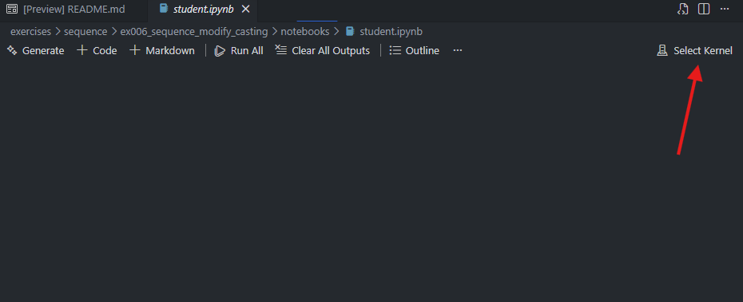
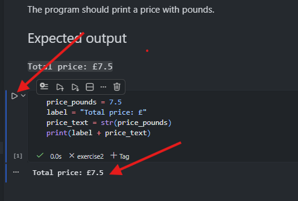
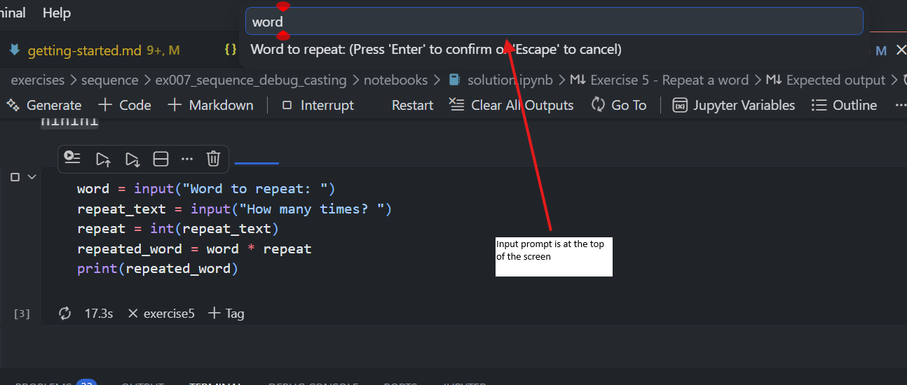
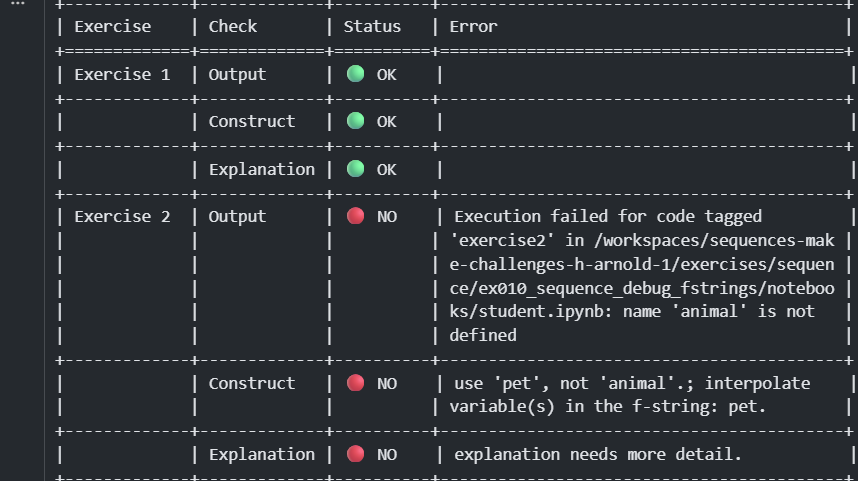

# In the Classroom — Running Exercises with Students

Once you've set up your GitHub Classroom assignment and students have accepted the invite link, this guide covers what happens next: how students open exercises, run code, use the self-checker, and submit their work.

> **📖 First time here?** Start with [Getting Started](getting-started.md) to set up your first assignment before using this guide.

- [In the Classroom — Running Exercises with Students](#in-the-classroom--running-exercises-with-students)
  - [Choose an exercise](#choose-an-exercise)
  - [Selecting the Python kernel](#selecting-the-python-kernel)
    - [How to tell if it has been selected or not](#how-to-tell-if-it-has-been-selected-or-not)
    - [How to select the correct kernel](#how-to-select-the-correct-kernel)
  - [Completing the exercises](#completing-the-exercises)
  - [Check progress with the self-checker](#check-progress-with-the-self-checker)
  - [Save and submit work](#save-and-submit-work)
  - [What you'll see as a teacher](#what-youll-see-as-a-teacher)
  - [What next?](#what-next)

---

## Choose an exercise

When the codespace opens for the first time, it should automatically open up the README page which has links to all the exercises in the assignment. Students can click on any exercise to open it in a new tab.

<figure>
  
  <figcaption>README page in the student's Codespace</figcaption>
</figure>

If the README page doesn't open automatically, students need to click on the `exercises` folder on the left hand side of the window, select the exercise they want to work on (e.g. `ex003_sequence_modify_variables`) and click on `student.ipynb` to open the exercise notebook.

<figure>
  
  <figcaption>Selecting an exercise notebook from the file explorer</figcaption>
</figure>

---

## Selecting the Python kernel

When the exercise opens, the Python kernel *should* be selected automatically, but this is flaky so it may not work.

### How to tell if it has been selected or not

**Correct Kernel has been selected**

Figure: The Jupyter kernel in the top right corner of the notebook shows `.venv (Python {version number})` e.g. `.venv (Python 3.11.4)`. If the kernel doesn't start with `.venv` then the wrong kernel has been selected and it won't work.

<figure>
  
  <figcaption>Jupyter kernel showing <code>.venv (Python 3.11.4)</code> in the top right corner</figcaption>
</figure>

**Kernel has NOT been selected**

<figure>
  
  <figcaption>Jupyter kernel has not been selected — no kernel is shown</figcaption>
</figure>

### How to select the correct kernel

1. Click on `Select Kernel` in the top right corner of the notebook.
2. Choose `Python Environments` from the source list.

<figure>
  
  <figcaption>Selecting the kernel source — choosing Python Environments</figcaption>
</figure>

3. Select the recommended kernel, which has a star next to it.

<figure>
  
  <figcaption>Selecting the recommended Python kernel with a star</figcaption>
</figure>

---

## Completing the exercises

Once a student has selected the correct kernel, they can complete the exercises in the notebook.

To run their code, they need to click on the play icon next to the code cell.

<figure>
  
  <figcaption>Clicking the play icon to run a code cell in a Jupyter notebook</figcaption>
</figure>

> **💡 Tip:** The input prompt in the VS Code Jupyter notebook appears at the top of the screen, rather than in the terminal or the code cell itself. It's easy to miss if you don't know what to look for.
>
> <figure>
>   
>   <figcaption>The input prompt when running code in a Jupyter notebook</figcaption>
> </figure>

---

## Check progress with the self-checker

At the bottom of each notebook is a **self-checker cell**. Running it shows a table like this:

<figure>
  
  <figcaption>The self-checker output in a Jupyter notebook</figcaption>
</figure>

Students get immediate, specific feedback on each exercise without waiting for you to mark their work.

> **👩‍🏫 Encourage students to run the self-checker after every exercise**, not just at the end. They catch mistakes sooner.

---

## Save and submit work

At the end of each lesson (or after finishing an exercise), students should:

1. Click the **Source Control** icon in the left sidebar (branch icon).
2. Type a short message (e.g., "Finished exercises 1 and 2").
3. Click **Commit** (✓), then **Sync Changes** to push to GitHub.

This backs up their work and, if you enabled autograding when you set up the assignment, triggers the tests and reports results to your Classroom dashboard.

---

## What you'll see as a teacher

> **Note:** The autograder is currently broken and I won't be fixing it until [Classroom 50](https://fifty.foundation/), the successor to GitHub Classroom, is released. In the meantime, you can still use the self-checker to give students feedback.

> **📖 Detailed classroom tips:** See [Classroom Practices](classroom-practices.md) for start-of-lesson routines, troubleshooting common issues, and building good git habits.

---

## What next?

| If you want to... | Read this |
| --- | --- |
| Run lessons more smoothly | [Classroom Practices](classroom-practices.md) — start-of-lesson routines, self-checker, git habits, troubleshooting |
| Understand the pedagogy | [Pedagogy](pedagogy.md) — why the Modify-Debug-Make framework works |
| Set up another assignment from scratch | [Getting Started](getting-started.md) — pick a template repo and create the assignment |
| Create brand-new exercises | [Creating and Editing Exercises](creating-and-editing-exercises.md) — with the AI assistant or by hand |
